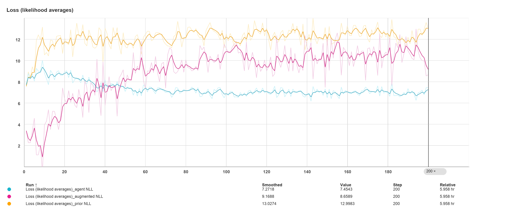

# 5eme_webinaire_pedagogique

# Open-Source Generative AI Tools in Chemistry
 
This README accompanies the **5th Pedagogical Webinar** and guides participants through the installation and setup of REINVENT4, an open-source AI-driven generative molecule design framework.
 
> **Reference:** Loeffler, J.R. et al. *REINVENT 4: Modern AI-driven generative molecule design.* J Cheminform 16, 20 (2024). [https://doi.org/10.1186/s13321-024-00812-5](https://link.springer.com/article/10.1186/s13321-024-00812-5)
 
---
 
## Contents
 
1. [Installation — REINVENT4](#installation--reinvent4)
2. [Dependencies — MAIZE](#dependencies--maize)
3. [Setting Up and Running a Generative Design Run](#setting-up-and-running-a-generative-design-run)
---
 
## Installation — REINVENT4
 
### Prerequisites
 
Ensure you have **Conda** (Miniconda or Anaconda) installed before proceeding. All prior public REINVENT models are available on [Zenodo](https://zenodo.org).
 
### Steps
 
**1. Clone the repository**
 
```bash
git clone https://github.com/MolecularAI/REINVENT4.git
cd REINVENT4
```
 
**2. Create and activate the Conda environment**
 
```bash
conda create --name reinvent4 python=3.10
conda activate reinvent4
```
 
**3. Install REINVENT4**
 
```bash
# CPU-only installation
python install.py cpu
 
# GPU-accelerated installation (requires a compatible NVIDIA GPU)
# python install.py cu126
```
 
> ⚠️ GPU/CUDA installation may require additional driver configuration on your system.
 
**4. Install analysis and visualisation dependencies**
 
```bash
pip install jupytext mols2grid seaborn
```
 
**5. Deactivate and return to the parent directory**
 
```bash
conda deactivate
cd ..
```
 
---
 
## Dependencies — MAIZE
 
MAIZE provides advanced scoring functions and property prediction nodes used within REINVENT4 workflows. It is recommended to install MAIZE in a dedicated Conda environment to avoid dependency conflicts.
 
> 📚 MAIZE tutorials: [REINVENT4 contrib/tutorials/maize](https://github.com/MolecularAI/REINVENT4/tree/main/contrib/tutorials/maize)
 
### Steps
 
**1. Clone the repository**
 
```bash
git clone https://github.com/MolecularAI/maize-contrib.git
cd maize-contrib
```
 
**2. Create and activate the environment**
 
```bash
conda env create -f env-users.yml
conda activate maize
```
 
**3. Install MAIZE**
 
```bash
pip install --no-deps .
```
 
**4. Deactivate and return to the parent directory**
 
```bash
conda deactivate
cd ..
```
 
---
 
## Setting Up and Running a Generative Design Run
 
A visual interface to setup the input file (.yaml) for the REINVENT run can be found in the accompanying page.
 
> 🔗 **[Web-app for compiling reward function→](https://github.com/btatsis/5eme_webinaire_pedagogique/blob/main/reinvent-mpo-editor.html)**  *(reinvent-mpo-editor.html)*

## Analysing the results from the REINVENT run


*Figure 1: NLL training curve for the REINVENT4 prior model.*

A web app that can help us select compounds based on a multiobjective optimisation approach (please see article https://doi.org/10.1021/acs.jcim.6c00421)

> 🔗 **[Web-app for selecting compounds based on a multiobjective optimisation method→](https://github.com/btatsis/5eme_webinaire_pedagogique/blob/main/reinvent-pareto-selector.html)**  *(reinvent-pareto-selector.html)*
